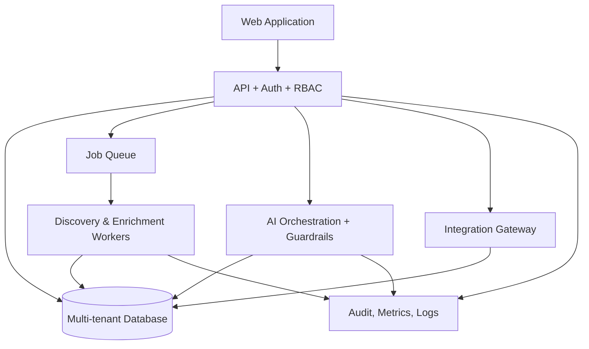

# تقرير CTO — AI Sales Engine Prototype

**تاريخ التقييم:** 14 أغسطس 2026  
**الحالة:** Prototype أمامي تفاعلي  
**قرار التسليم:** لا يوجد تسليم لنسخة المشروع ضمن هذا التقرير  
**القرار التقني المقترح:** **GO للتثبت من المنتج وتجهيز مرحلة البناء الإنتاجي، وNO-GO للإطلاق التشغيلي الحالي.**

## 1. الملخص التنفيذي

تم بناء Prototype تفاعلي لمنصة **AI Sales Engine** يجسّد المنتج كرحلة مترابطة من اكتشاف الشركات إلى الإيراد، وليس كمجموعة شاشات مستقلة. يربط النموذج بين إنشاء طلب اكتشاف، مراحل معالجة المهمة، النتائج، تحليل الفرص بالذكاء الاصطناعي، ملف العميل الموحد، CRM، المحادثات، Pipeline، الصفقة، والإسناد إلى مصدر الاكتشاف.

الوضع الحالي مناسب لعرض الرؤية على الإدارة والفرق التجارية والمنتج، ولجمع ملاحظات تجربة المستخدم والتحقق من تسلسل العمل. لكنه ليس نظام SaaS تشغيليًا بعد؛ إذ لا يحتوي على خادم خلفي أو قاعدة بيانات أو مهام معالجة أو تكاملات حقيقية أو نظام هوية وصلاحيات. كل البيانات والأحداث تعمل محليًا داخل المتصفح وتُفقد عند إعادة التحميل.

> **الخلاصة:** القيمة المثبتة الآن هي *تصميم المنتج، تدفق العمل، ولغة الواجهة*. القيمة التي لم تُبنَ بعد هي *الاعتمادية التشغيلية، اكتساب البيانات الحقيقي، التعددية المؤسسية، والأمان والقياس الإنتاجي*.

| محور القرار | تقييم CTO | التفسير |
|---|---:|---|
| وضوح المنتج وتدفق المستخدم | قوي | الرحلة من المصدر إلى Lead ثم CRM وRevenue متماسكة ومتصلة. |
| جاهزية UX validation | قوي | الشاشات والبيانات التجريبية والتفاعلات تكفي لورش التحقق مع المستخدمين. |
| جاهزية Prototype للعرض | قوي | يوجد Landing وLogin وOnboarding وواجهات تشغيل رئيسية ومسار Demo. |
| الجاهزية للإطلاق التشغيلي | غير جاهز | لا توجد طبقة بيانات أو APIs أو Auth أو Workers أو Integrations حقيقية. |
| قابلية صيانة المنتج الحالي | متوسطة للـPrototype | الشيفرة منظمة إلى وحدات JavaScript، لكنها تحتاج إعادة تنظيم نطاقية عند بدء الإنتاج. |

## 2. دليل الحالة الحالية

تم التحقق من بناء المشروع في وضع الإنتاج بنجاح عبر `pnpm build` بتاريخ التقييم. واجهة الـPrototype مبنية بملفات HTML وCSS وVanilla JavaScript، مع **7 ملفات JavaScript تشغيلية** و**5 ملفات CSS** مخصصة للهوية والتخطيط والمكوّنات والصفحات والاستجابة.

كما تم فحص طبقة JavaScript الحالية بحثًا عن طلبات شبكة أو تخزين دائم. لم تظهر استدعاءات `fetch` أو `axios` أو `XMLHttpRequest` أو `WebSocket` أو `localStorage` أو `sessionStorage`. هذه النتيجة تؤكد أن النموذج لا يدّعي وجود تكاملات تشغيلية أو حفظ بيانات غير موجودين فعليًا.

| مكوّن | الحالة | ملاحظة CTO |
|---|---:|---|
| `client/index.html` | مكتمل | نقطة دخول ثابتة للـPrototype. |
| `client/css/` | مكتمل | نظام بصري عربي أولًا: حبر/أبيض/سماوي، وسكة قرار مشتركة. |
| `client/js/data.js` | مكتمل | بيانات أعمال وعملاء ومحادثات وJobs وهمية مترابطة. |
| `client/js/app.js` | مكتمل | Hash routing، تنقل، أوامر محلية، رحلة Demo، سمة ولغة. |
| `dashboard.js` و`discovery.js` | مكتمل | سطح قيادة، اكتشاف، Job، نتائج، Intelligence، ملف العميل. |
| `sales.js` و`operations.js` | مكتمل | CRM وPipeline وInbox وAgent وAutomation والتحليلات والصفقات والمهام والإعدادات. |
| Backend / DB / Queue | غير موجود | خارج نطاق الـPrototype الحالي. |

## 3. التغطية الوظيفية مقابل المواصفات

الجدول التالي يميّز بوضوح بين ما هو **منفذ كتجربة تفاعلية** وما هو **محاكاة محلية** وما هو **غير منفذ إنتاجيًا**.

| المجال | التغطية في الـPrototype | الحالة التشغيلية |
|---|---|---|
| Landing، Login، Onboarding | موجودة مع مسار انتقال إلى مساحة العمل | محاكاة؛ لا يوجد Auth حقيقي. |
| Dashboard التنفيذي | KPIs، قمع اكتساب، Jobs، مهام، ترشيحات AI، محادثات وPipeline | بيانات محلية ثابتة ومتحركة داخل الجلسة. |
| Lead Discovery | نموذج طلب بحث، مرشحات، وعرض مراحل Job | لا توجد عملية جمع بيانات أو Scraping أو API. |
| Job Progress | تقدم مرحلي من البحث إلى scoring | محاكاة زمنية داخل JavaScript. |
| Results | جدول بيانات أعمال قابل للتحديد والبحث والإجراء الجماعي | لا توجد نتائج واردة من مصدر خارجي. |
| AI Lead Intelligence | Score وإشارات وفرص وعرض مقترح وخطوة تالية | منطق توضيحي وقواعد محلية، لا يوجد نموذج AI فعلي. |
| Lead 360° | Timeline، حقائق، سياق، Quick Actions وCopilot | حالة محلية لا تستمر بعد تحديث الصفحة. |
| CRM وPipeline | جدول Leads وKanban ونقل بطاقات بالسحب والإفلات | لا توجد قاعدة بيانات أو تاريخ تدقيق. |
| Unified Inbox | قائمة محادثات وسياق العميل ومقترحات ردود | لا توجد قنوات WhatsApp/Instagram/Web Chat حقيقية. |
| AI Sales Agent | شاشة قدرات وقواعد وحالات وتصعيد ومؤشرات | لا يوجد Agent runtime أو LLM أو أدوات تنفيذ. |
| Automation | Workflow بصري بعقد Trigger/Condition/Action/Approval | لا يوجد محرك Workflow أو Queue أو Webhooks. |
| Tasks وDeals | مهام ومواعيد ونشاط صفقة وForecast | الحالة محلية ومبنية على بيانات Mock. |
| Analytics وAttribution | مصادر وقمع وتحليلات AI وسلسلة Lead-to-Revenue | مؤشرات محسوبة/ثابتة للعرض، لا توجد بيانات فعلية. |
| Integrations وBilling وSettings | Marketplace وإدارة ومؤشرات استخدام وفواتير واجهة | لا توجد OAuth أو مفاتيح أو مدفوعات أو أسرار. |
| RTL / LTR وDark Mode | تبديل اتجاه وسمة محلي | الترجمة الإنجليزية جزئية في الغلاف والتنقل، وليست تعريبًا كاملًا لكل النصوص. |

## 4. تدفق المنتج الذي تم تثبيته

تم تثبيت المسار التالي كقصة منتج يمكن اختبارها داخل الواجهة. هذه هي أهم نتيجة للـPrototype، لأنها تبيّن كيف تنتقل قيمة السجل نفسه بين الفرق والوظائف بدل أن تُفقد بين أدوات مختلفة.

داخل التطبيق، توجد **سكة قرار** متكررة في الصفحات الداخلية: **اكتشاف → نتائج → قرار → CRM → متابعة**. وهي جزء من هوية المنتج، وليست شريط تقدم عابرًا؛ إذ تهدف إلى تذكير المستخدم بأن مصدر العميل وإشاراته وقراراته تظل مرتبطة حتى مرحلة المتابعة والإيراد.

## 5. تقييم البنية الحالية

### 5.1 نقاط القوة

تفصل البنية الحالية بين البيانات التجريبية والتنقل ووحدات الواجهات. هذا مناسب جدًا لمرحلة Prototype لأن التعديل على سيناريو العميل أو ترتيب الصفحات لا يتطلب خادمًا أو ترحيلات قاعدة بيانات. كما أن الاعتماد على Hash routes يجعل كل شاشة قابلة للوصول داخل تجربة ثابتة واحدة.

استخدام كيان أعمال موحّد في `data.js` يمثل قرارًا صحيحًا من زاوية المنتج. نفس الشركة تظهر في Results وIntelligence وLead Profile وCRM وInbox وPipeline وDeals وAnalytics. هذا يمنع تحويل النظام إلى واجهات منفصلة بلا سياق.

| قرار معماري حالي | أثره الإيجابي | حدّه |
|---|---|---|
| Vanilla JavaScript Modules | بسيط وسريع للـPrototype ولا يفرض طبقة تشغيل إضافية | ستزداد كلفة إدارة الحالة والاختبارات عند نمو المنتج. |
| In-memory State | يسمح بعرض رحلة متغيرة داخل الجلسة | لا توجد استمرارية أو تعددية مستخدمين أو سجل تدقيق. |
| Hash Router | لا يحتاج خادم routing أو Backend | ليس بديلًا عن صلاحيات الصفحات أو روابط الكيانات الدائمة. |
| CSS Tokens | يحافظ على هوية هادئة ومتسقة | يحتاج Design System موثق إذا زادت الفرق والواجهات. |
| Mock Data مشتركة | يوضح علاقات المنتج والمصادر والأثر | لا يثبت جودة مصادر البيانات أو دقتها أو امتثالها. |

### 5.2 القيود التقنية المقصودة

هذه القيود ليست أخطاء في الـPrototype؛ هي نتيجة مباشرة للقرار المتفق عليه باستخدام HTML وCSS وJavaScript فقط. يجب عدم تحويلها إلى افتراضات إنتاجية عند التخطيط للنسخة التشغيلية.

| القيد | الأثر الحالي | ما يلزم للإنتاج |
|---|---|---|
| لا Backend | لا يمكن حماية أسرار أو تنفيذ قواعد أعمال موثوقة | API server بطبقة مصادقة وتفويض. |
| لا Database | كل تقدم يضيع بعد إعادة التحميل | قاعدة بيانات متعددة المستأجرين مع migrations وbackup. |
| لا Queue / Workers | لا يمكن تشغيل Jobs طويلة أو قابلة للاستئناف | طوابير ومشغلات Workers وdead-letter handling. |
| لا Integrations | لا توجد رسائل أو CRM أو Calendar حقيقية | OAuth، webhooks، مراجع idempotency، وإدارة tokens. |
| لا AI Runtime | التحليل والمقترحات عرضية فقط | خدمة LLM محكومة بالسياق والحدود والتقييم والمراجعة البشرية. |
| لا تصدير/استيراد فعلي | نتائج وCSV/Excel ليست workflow موثوقًا | Service لتوليد الملفات والتحقق من المخطط والحقول. |
| لا Auth / RBAC | لا يمكن فصل فرق أو عملاء أو صلاحيات | SSO/OAuth، roles، permissions، audit logs. |

## 6. المخاطر والضوابط المطلوبة قبل الإنتاج

أكبر مخاطر التحول ليست في واجهة CRM، بل في **مصدر البيانات وحقوق استخدامها، والمهام الطويلة، وقنوات التواصل، وحماية بيانات العملاء**. يجب اعتماد هذه القرارات قبل بدء التنفيذ الخلفي حتى لا يصبح الواجهة المتقدمة غطاءً لطبقة تشغيل غير قابلة للامتثال أو التوسع.

| مستوى | الخطر | الضبط المطلوب قبل الإطلاق |
|---|---|---|
| حرج | استخدام مصادر بيانات أو محتوى لا يسمح بشروطه بالاستخراج أو التخزين | اعتماد مصدر/مزود مصرح به لكل حقل، وسياسة موافقة واحتفاظ وحذف. |
| حرج | تسريب بيانات جهات اتصال أو أسرار تكاملات | Vault للأسرار، تشفير، تفويض دقيق، سجلات وصول، وفصل المستأجرين. |
| حرج | إرسال رسائل غير خاضعة للموافقة أو القواعد | موافقات صريحة، limits، human approval، سجل إرسال، وقواعد opt-out. |
| عالٍ | Jobs مكتملة جزئيًا أو مكررة | Queue idempotent، checkpoints، retries، DLQ، ومراقبة مراحل المعالجة. |
| عالٍ | درجات AI غير قابلة للتفسير أو متحيزة | مصدر لكل إشارة، confidence، rule trace، مراجعة بشرية، ومؤشرات جودة. |
| عالٍ | فشل Attribution عند تعدد المصادر والقنوات | نموذج touchpoints موحد، event IDs، وسياسة attribution معلنة. |
| متوسط | تضخم واجهة Vanilla JavaScript | اختيار إطار واجهة/حالة عند بدء الإنتاج أو فرض وحدات واختبارات صارمة. |
| متوسط | عدم دقة مؤشرات الإيراد أو الفواتير | مصدر حقيقة مالي منفصل، reconciliation، وعدم استخدام بيانات العرض في قرار مالي. |

## 7. المعمارية المستهدفة للمنتج التشغيلي

التوصية هي عدم تحويل الـPrototype مباشرة إلى SaaS عبر ترقيعات. المطلوب هو الاحتفاظ باللغة البصرية وتدفق المنتج، ثم استبدال طبقات العرض الوهمية بعقود خدمات واضحة.

| طبقة | مسؤوليتها | قرار مطلوب |
|---|---|---|
| Web Application | تجربة المستخدم، الجداول، الـPipeline، الـInbox، وLead 360° | هل تبقى Vanilla JS أم تُنقل إلى React/TypeScript عند الإنتاج؟ |
| API Layer | مصادقة، RBAC، validation، tenancy، rate limits | اختيار نمط الخدمة وإصدار API contracts. |
| Database | Leads، touchpoints، jobs، results، conversations، deals، activities، audit | اختيار محرك علائقي وخطة عزل العملاء. |
| Worker Platform | Jobs الاكتشاف والإثراء والتصدير والمزامنة | اختيار queue، retries، monitoring، وسقف تكلفة لكل Job. |
| AI Orchestration | scoring، analysis، next best action، agent assist | سياسة نماذج، guardrails، logging، human approval. |
| Integration Gateway | CRM، قنوات محادثة، calendar، webhooks، imports | تحديد أول 2–3 تكاملات لا بناء Marketplace كامل مبكرًا. |
| Observability | logs، traces، errors، business metrics | تعريف SLOs وaudit قبل تشغيل أول عميل فعلي. |

## 8. خارطة طريق التحويل من Prototype إلى منتج

يوصى بالعمل على مسارات رأسية قابلة للإثبات بدل محاولة بناء كل صفحة وكل تكامل معًا. الأولوية ليست لـ«عدد الشاشات»، بل لإثبات رحلة موثوقة واحدة من مصدر مسموح إلى الإيراد.

| المرحلة | النطاق | معيار الخروج |
|---|---|---|
| P0 — Product & Compliance | اعتماد ICP، مصدر البيانات، الحقول، سياسة الاحتفاظ، وأول CRM خارجي | وثيقة بيانات وشروط استخدام وسياسة موافقات معتمدة. |
| P1 — Foundation | Auth، tenancy، RBAC، DB schema، audit، observability، feature flags | مستخدمان من مؤسستين منفصلتين لا يريان بيانات بعضهما. |
| P2 — Discovery Vertical Slice | Job API، queue، worker، نتائج منظمة، dedupe، مصدر واضح لكل سجل | Job قابل للاستئناف ينتج بيانات موثقة ويمكن مراجعتها. |
| P3 — CRM & Attribution | Leads، activities، pipeline، deals، touchpoints، export | يمكن تتبع Deal إلى Job ومصدره عبر بيانات دائمة. |
| P4 — Communication | قناة واحدة أولًا، inbox، templates، opt-out، handoff بشري | إرسال/استقبال موثق مع موافقة وتدقيق وتصعيد. |
| P5 — AI Assist | scoring قابل للتفسير، summaries، suggested actions، evaluation | توصيات قابلة للمراجعة ولا تنفذ إجراءات حساسة تلقائيًا. |
| P6 — Integrations & Billing | CRM خارجي واحد، calendar، billing حقيقي، webhooks | مزامنة idempotent وفواتير قابلة للمراجعة. |

## 9. قرارات CTO مطلوبة الآن

لا ينبغي بدء Backend قبل إغلاق القرارات التالية. هذه القرارات تقلل إعادة البناء أكثر من أي اختيار CSS أو إطار واجهة.

| القرار | الخيارات | التوصية الأولية |
|---|---|---|
| أول ICP | وكالات، عيادات، عقار، B2B خدمات | اختيار قطاع واحد للـVertical Slice: **الوكالات أو عيادات الخدمات**. |
| مصدر البيانات الأول | API مرخص، بيانات عميل، import، مزود بيانات | البدء بـ**Import + مصدر مرخص واحد**، لا الاعتماد على scraping. |
| أول تكامل CRM | HubSpot، Zoho، Salesforce، CSV | البدء بـ**CSV مضبوط** ثم CRM واحد وفق عملاء التصميم. |
| قناة التواصل الأولى | WhatsApp، Instagram، Web Chat، Email | اختيار قناة واحدة مع موافقات واضحة؛ لا بناء Unified Inbox كامل أولًا. |
| سياسة AI Agent | Assist فقط أو semi-autonomous | البدء بـ**Assist + Human Approval** في أي إرسال أو تغيير تجاري. |
| بنية الواجهة الإنتاجية | استمرار Vanilla JS أو React/TypeScript | نقلها إلى **React/TypeScript** إذا شمل فريق التنفيذ أكثر من مطورين أو زادت الحالة المعقدة. |
| مقياس النجاح الأول | عدد Leads أو conversion أو revenue | **نسبة Job → Qualified Lead → Meeting** قبل قياس Revenue الكامل. |

## 10. تعريف «جاهز للإطلاق التجريبي»

لا يعتبر المنتج جاهزًا لتجربة عملاء فعلية إلا عند تحقق العناصر التالية مع بيانات دائمة ومراقبة فعلية:

| مجال | شرط جاهزية تجريبي |
|---|---|
| البيانات | مصدر مسموح، provenance لكل سجل، سياسة حذف واحتفاظ، وdedupe موثوق. |
| الحسابات | Auth وRBAC وعزل مستأجرين ومراجعة صلاحيات. |
| Jobs | queue، retry، monitoring، retry-safe processing، وإظهار مراحل دقيقة للمستخدم. |
| CRM | Lead وActivity وDeal وتاريخ تغييرات وعلاقات مصدر غير قابلة للفقد. |
| القنوات | موافقة، opt-out، limits، human handoff، وسجل كل إرسال واستقبال. |
| AI | حدود واضحة، explainability، مراجعة بشرية، تقييم جودة، وعدم تنفيذ حساس ذاتيًا. |
| القياس | events، attribution، dashboard موثوق، وreconciliation مع مصدر الإيراد. |
| التشغيل | logs، alerts، backup، recovery، اختبار أمني، وخطة دعم. |

## 11. الخلاصة التنفيذية

الـPrototype الحالي يحقق الهدف الصحيح للمرحلة الحالية: **يوحّد فكرة المنتج بصريًا ووظيفيًا ويثبت المسار من اكتشاف العميل إلى الإيراد**. وهو مناسب الآن لعرض CTO/Product Review، واختبار الرحلة مع مستخدمين محتملين، واتخاذ قرارات النطاق والمصادر والتكاملات.

لكن لا ينبغي اعتباره نسخة قابلة للإطلاق أو أساسًا مباشرًا لتشغيل scraping أو حملات مبيعات أو CRM لعملاء فعليين. الانتقال الصحيح هو بناء Vertical Slice خلفي آمن ومقاس، يبدأ بمصدر بيانات مسموح وJob قابل للاستئناف ثم CRM وإسناد مصدر، قبل توسيع القنوات والوكيل الذكي والتكاملات.

> **توصية CTO النهائية:** ثبّت الـPrototype كمرجع تجربة المنتج، واعتمد P0 وP1 فورًا، ثم نفّذ P2 كرحلة تشغيلية واحدة قابلة للتدقيق. لا توسع واجهات أو Integrations جديدة قبل إثبات سلامة هذه الرحلة من المصدر إلى Qualified Lead.

## مراجع داخلية

| المرجع | الدليل المستخدم |
|---|---|
| [1] | `client/js/app.js` — Hash routing، الحالة المحلية، اللغة، السمة، رحلة العرض. |
| [2] | `client/js/data.js` — الكيانات الوهمية المشتركة بين الاكتشاف والمبيعات. |
| [3] | `client/js/dashboard.js` و`discovery.js` — رحلة Dashboard → Discovery → Job → Results → Intelligence → Lead 360°. |
| [4] | `client/js/sales.js` و`operations.js` — CRM وInbox وAgent وAutomation والصفقات والتحليلات والصفحات المساندة. |
| [5] | نتيجة `pnpm build` بتاريخ 14 أغسطس 2026 — بناء إنتاجي ناجح. |
| [6] | فحص ملفات `client/js` بتاريخ 14 أغسطس 2026 — لم تظهر استدعاءات شبكة أو تخزين دائم في النموذج الحالي. |
