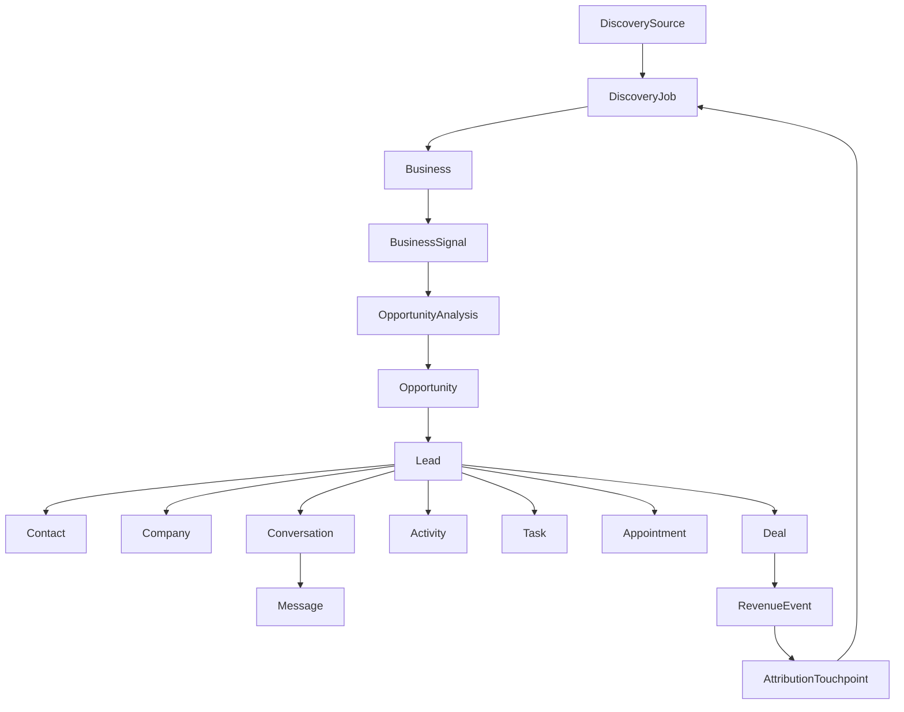

# ENTITY MODEL — AI Customer Acquisition & Sales

**الحالة:** مرجع S0 للبيانات الوهمية المشتركة  
**المبدأ:** مصدر واحد للحالة داخل الجلسة؛ لا تنشأ نسخة منفصلة من Business أو Lead لكل شاشة.

## 1. سلسلة القيمة الأساسية



## 2. الكيانات الأساسية ومعرفاتها

| الكيان | المفتاح | الغرض | علاقات رئيسية | الحالة الداخلية |
|---|---|---|---|---|
| DiscoverySource | `SRC-####` | يمثل أصل البيانات أو الاستيراد | يملك Jobs متعددة | Active / Disabled / Mock |
| DiscoveryJob | `JOB-####` | طلب اكتشاف محدد بكلمات ومواقع وفلاتر | مصدر واحد، Businesses متعددة | pending / processing / completed / failed / cancelled |
| Business | `BUS-####` | سجل العمل التجاري المكتشف | Signals وفرصة وLead اختياري | active / archived |
| BusinessSignal | `SIG-####` | دليل قابل للتتبع عن الحضور أو النشاط أو فجوة مثبتة | يتبع Business | positive / neutral / gap / unknown |
| OpportunityAnalysis | `ANL-####` | تحليل حتمي يجمع Signals ودرجة وثقة وإصدار Scoring | يتبع Business فقط | not_analyzed / analyzing / analyzed / insufficient_data |
| Opportunity | `OPP-####` | تفسير فرصة البيع وخدماتها المقترحة قبل CRM | يتبع Business وAnalysis | open / reviewed / dismissed |
| Lead | `LEAD-####` | سجل البيع الرئيسي بعد الإضافة إلى CRM | Business، Owner، Activities، Deal | new / contacted / qualified / unqualified / nurturing |
| Contact | `CON-####` | شخص قابل للتواصل | Company وLead ومحادثات | active / opted_out |
| Company | `CMP-####` | حساب تجاري موحد | Contacts وLeads وDeals | active / inactive |
| Conversation | `CONV-####` | محادثة ضمن قناة | Lead، Messages، Owner | open / waiting / assigned / closed |
| Message | `MSG-####` | رسالة منفردة داخل Conversation | Conversation وActivity | inbound / outbound / draft |
| Activity | `ACT-####` | أثر تشغيلي: رسالة أو اتصال أو note أو تغيير مرحلة | Lead وDeal اختياري | logged |
| Task | `TSK-####` | عمل مطلوب بمالك وموعد | Lead أو Deal | pending / in_progress / completed / overdue |
| Appointment | `APT-####` | اجتماع أو موعد | Lead/Contact/Deal | scheduled / completed / cancelled |
| Deal | `DEAL-####` | فرصة مالية في Pipeline | Lead وPipelineStage وRevenueEvent | open / won / lost |
| Pipeline | `PIPE-####` | تعريف مسار المبيعات | PipelineStages وDeals | active |
| PipelineStage | `STG-####` | مرحلة ضمن Pipeline | Pipeline وDeals | active |
| Automation | `AUTO-####` | workflow مكوّن من trigger/condition/action | Lead/Task/Conversation | active / paused / draft |
| AIAgent | `AGT-####` | إعدادات وكيل مبيعات ذكي | Automations وRecommendations | active / paused |
| AIRecommendation | `AIR-####` | توصية قابلة للمراجعة | Lead/Conversation/Opportunity | pending / accepted / dismissed |
| RevenueEvent | `REV-####` | إيراد منسوب إلى صفقة | Deal وAttributionTouchpoints | recognized / pending |
| AttributionTouchpoint | `ATT-####` | نقطة إسناد تصل الإيراد بالأصل | RevenueEvent وDiscoveryJob | first_touch / assist / last_touch |
| User | `USR-####` | عضو فريق | Team وOwnership | active / inactive |
| Team | `TEAM-####` | مساحة العمل/المؤسسة | Users وPipelines وSettings | active |

## 3. قواعد معرفات ثابتة

1. كل كيان يملك معرفًا لا يتغير داخل البيانات الوهمية.  
2. المعرف المعروض تقني ويقرأ LTR داخل واجهة RTL، مثل `BUS-1042` و`DEAL-4042`.  
3. تتحرك الحالة عبر المرجع نفسه؛ لا تنشأ Business جديدة عند تحويلها إلى Lead.  
4. يتحول `Business` إلى `Lead` عبر رابط صريح `businessId`، ويستمر `sourceJobId` حتى Revenue Attribution.  
5. يجب أن تشير كل Activity وConversation وDeal إلى `leadId` أو إلى سياق كيان واضح.  

## 4. نموذج الحالة المشتركة في الـPrototype

```text
state = {
  lang: "ar",
  theme: "light",
  selectedBusinessId: "BUS-1042",
  selectedConversationId: "CONV-3042",
  selectedResultIds: [],
  discoveryStatus: "idle",
  discoveryProgress: 0,
  crmAdded: [],
  demoActive: false,
  mockMessageSent: false,
  meetingCreated: false,
  dealCreated: false
}
```

### 4.1 عقد S3 لعملية الاكتشاف

كل `DiscoveryJob` في S3 تستخدم عقدًا واحدًا في `data.js`: `id` و`sourceId` و`name` و`keywords` و`locations` و`filters` و`combinationCount` و`status` و`createdAt` و`startedAt` و`completedAt` و`progress` و`foundCount` و`duplicateCount` و`deduplicatedCount` و`resultBusinessIds`. قيم التواريخ مثل `createdAt` آلية بصيغة ISO، بينما يحولها Formatter عربي إلى «اليوم، 10:42» أو قيمة عرض مماثلة. تعكس شاشة النتائج العينة المرتبطة بـ`resultBusinessIds` فقط، وفقط عندما تكون حالة Job هي `completed`؛ أما الأعداد الأعلى فهي ملخص تجربة Mock وليست rows مزيفة إضافية.

تتحقق S3 من العلاقات: `Business.discoveryJobId` موجود، و`DiscoveryJob.sourceId` موجود، و`keywords × locations = combinationCount`، و`foundCount - duplicateCount = deduplicatedCount` للعمليات المكتملة. لا تضيف S3 Lead أو AI Score أو CRM عند إنشاء Business.

الحالة السابقة مؤقتة داخل الذاكرة وليست بديلاً عن قاعدة بيانات. الغرض منها في S0 هو إثبات أن تغيير مرحلة Lead أو إنشاء Deal يمكن أن ينعكس على السياق المشترك بدل عرض بيانات متناقضة في كل صفحة.

## 5. القيم البرمجية مقابل الـLabels العربية

| المجال | القيمة البرمجية | التسمية المعروضة |
|---|---|---|
| Discovery Job | `pending` | قيد الانتظار |
| Discovery Job | `processing` | قيد المعالجة |
| Discovery Job | `completed` | مكتمل |
| Discovery Job | `failed` | فشل |
| Discovery Job | `cancelled` | ملغي |
| Lead | `new` | جديد |
| Lead | `contacted` | تم التواصل |
| Lead | `qualified` | مؤهل |
| Lead | `unqualified` | غير مؤهل |
| Lead | `nurturing` | متابعة تدريجية |
| Deal | `open` | مفتوحة |
| Deal | `won` | رابحة |
| Deal | `lost` | خاسرة |
| Conversation | `open` | مفتوحة |
| Conversation | `waiting` | بانتظار العميل |
| Conversation | `assigned` | مسندة |
| Conversation | `closed` | مغلقة |
| Task | `pending` | قيد الانتظار |
| Task | `in_progress` | قيد التنفيذ |
| Task | `completed` | مكتملة |
| Task | `overdue` | متأخرة |

## 6. عقد S4 لذكاء الفرص

يعتمد S4 سلسلة واحدة قابلة للتتبع: `DiscoverySource → DiscoveryJob → Business → BusinessSignal → OpportunityAnalysis → Opportunity`. لا ينشئ S4 `Lead` أو `Company` أو `Deal` أو أي سجل CRM؛ تظل الفرصة تفسيرًا قبل مرحلة CRM.

تستخدم `OpportunityAnalysis` الحقول `businessId` و`signalIds` و`status` و`confidence` (نسبة من 0 إلى 1) و`scoringVersion` و`analyzedAt`. الدرجة ليست قيمة سحرية في الواجهة؛ بل تحسب من مجموع أبعاد ثابتة: **قوة النشاط 25، الفرصة الرقمية 30، قابلية التواصل 20، ملاءمة الخدمة 15، جودة البيانات 10**. المجموع من 0 إلى 100، والإصدار الحالي هو `S4-MOCK-v1`.

| Tier | نطاق الدرجة |
|---|---:|
| عالية | 80–100 |
| جيدة | 65–79 |
| متوسطة | 40–64 |
| منخفضة | 0–39 |

تعني `unknown` أن الدليل غير متاح، وليس إشارة سلبية. لذلك تظهر السجلات التي تفتقد إشارات النشاط والاتصال الأساسية بحالة `insufficient_data` من دون درجة رقمية مضللة. تتولد الخدمات المقترحة فقط من `gapCode` المثبت في Signal ومن `serviceCatalog` المركزي.

### 6.1 عقد Fixtures المعتمد للقبول

| Fixture | الدور المعتمد | السلوك المرجعي |
|---|---|---|
| `BUS-1042` | High Opportunity exemplar | Score 92 وفرصة عالية مع فجوات وخدمات مثبتة. |
| `BUS-1402` | Strong Business / Not High Opportunity counterexample | Score 51، مؤشرات نشاط وجودة قوية، ولا توجد فجوة مبيعات meaningful أو خدمة مقترحة. |
| `BUS-1404` | Insufficient Data exemplar | `insufficient_data` بلا Score أو خدمة؛ unknown ليست negative. |
| `BUS-1403` | Error → Retry exemplar | يبدأ `analysis_error` بلا Score، ثم يعيد retry تحليلًا حتميًا من Signals نفسها. |

## 7. إضافات S5 — Lead 360 + CRM

تظل `Business` سجل الاكتشاف و`Opportunity` ناتج Intelligence. تنشأ `Lead` فقط بعد تأكيد مستخدم صريح من Conversion Preview، ولا تنسخ Business أو Score أو Signals أو Opportunity؛ بل تحمل مراجع `businessId` و`companyId` و`ownerId` و`sourceJobId` مع حالة وأولوية وطوابع زمنية.

| الكيان | الحقول المرجعية | القاعدة |
|---|---|---|
| `Lead` | `businessId`, `companyId`, `ownerId`, `sourceJobId` | Lead واحدة كحد أقصى لكل Business. |
| `Company` | `businessId` | تنشأ مع التحويل وتبقى مرجعًا لـBusiness. |
| `Contact` | `leadId`, `companyId` | ينشأ فقط عند وجود هاتف أو بريد في Business. |
| `Task` | `leadId`, `ownerId` | تحتوي status وpriority وdueAt وcreatedAt. |
| `Note` | `leadId`, `authorId` | ملاحظة محلية بطابع زمني. |
| `Activity` | `leadId` | Timeline للتحويل والمالك والحالة والأولوية والمهام والملاحظات. |

حالات Lead المسموحة هي: `new` و`contacted` و`qualified` و`unqualified` و`nurturing`. لا تنشئ S5 Deal أو Pipeline؛ يبقى كل ما يرتبط بالصفقات قراءة فقط حتى S6. يمنع `businessId` المكرر إنشاء Lead ثانية ويعيد المستخدم إلى Lead القائمة.

## 7. قواعد المنتج غير القابلة للكسر

> Google Maps هو مصدر Leads، وWhatsApp قناة، وCRM ذاكرة تشغيلية. الرابط الحقيقي بين هذه الطبقات هو Intelligence + Sales Workflow.

لا يعرض المنتج كشفًا كأنه القيمة النهائية. القيمة هي تفسير Signals وتحديد Opportunity وتوجيه العميل إلى الإجراء التالي، ثم الاحتفاظ بسجل الإسناد حتى صفقة وإيراد قابلين للقياس.
