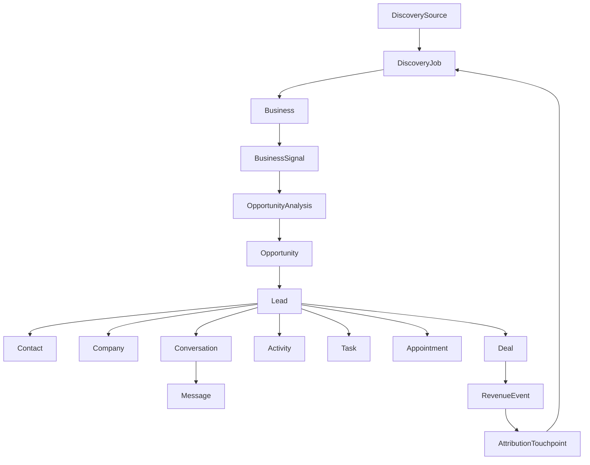

# ENTITY MODEL — AI Customer Acquisition & Sales

**الحالة:** مرجع S0 للبيانات الوهمية المشتركة  
**المبدأ:** مصدر واحد للحالة داخل الجلسة؛ لا تنشأ نسخة منفصلة من Business أو Lead لكل شاشة.

## 1. سلسلة القيمة الأساسية



## 2. الكيانات الأساسية ومعرفاتها

| الكيان | المفتاح | الغرض | علاقات رئيسية | الحالة الداخلية |
|---|---|---|---|---|
| DiscoverySource | `SRC-####` | يمثل أصل البيانات أو الاستيراد | يملك Jobs متعددة | Active / Disabled / Mock |
| DiscoveryJob | `JOB-####` | طلب اكتشاف محدد بكلمات ومواقع وفلاتر | مصدر واحد، Businesses متعددة | pending / processing / completed / failed / cancelled |
| Business | `BUS-####` | سجل العمل التجاري المكتشف | Signals وفرصة وLead اختياري | active / archived |
| BusinessSignal | `SIG-####` | دليل قابل للتتبع عن الحضور أو النشاط أو فجوة مثبتة | يتبع Business | positive / neutral / gap / unknown |
| OpportunityAnalysis | `ANL-####` | تحليل حتمي يجمع Signals ودرجة وثقة وإصدار Scoring | يتبع Business فقط | not_analyzed / analyzing / analyzed / insufficient_data |
| Opportunity | `OPP-####` | تفسير فرصة البيع وخدماتها المقترحة قبل CRM | يتبع Business وAnalysis | open / reviewed / dismissed |
| Lead | `LEAD-####` | سجل البيع الرئيسي بعد الإضافة إلى CRM | Business، Owner، Activities، Deal | new / contacted / qualified / unqualified / nurturing |
| Contact | `CON-####` | شخص قابل للتواصل | Company وLead ومحادثات | active / opted_out |
| Company | `CMP-####` | حساب تجاري موحد | Contacts وLeads وDeals | active / inactive |
| Conversation | `CONV-####` | محادثة ضمن قناة | Lead، Messages، Owner | open / waiting / assigned / closed |
| Message | `MSG-####` | رسالة منفردة داخل Conversation | Conversation وActivity | inbound / outbound / draft |
| Activity | `ACT-####` | أثر تشغيلي: رسالة أو اتصال أو note أو تغيير مرحلة | Lead وDeal اختياري | logged |
| Task | `TSK-####` | عمل مطلوب بمالك وموعد | Lead أو Deal | pending / in_progress / completed / overdue |
| Appointment | `APT-####` | اجتماع أو موعد | Lead/Contact/Deal | scheduled / completed / cancelled |
| Deal | `DEAL-####` | فرصة مالية في Pipeline | Lead وPipelineStage وRevenueEvent | open / won / lost |
| Pipeline | `PIPE-####` | تعريف مسار المبيعات | PipelineStages وDeals | active |
| PipelineStage | `STG-####` | مرحلة ضمن Pipeline | Pipeline وDeals | active |
| Automation | `AUTO-####` | workflow مكوّن من trigger/condition/action | Lead/Task/Conversation | active / paused / draft |
| AIAgent | `AGT-####` | إعدادات وكيل مبيعات ذكي | Automations وRecommendations | active / paused |
| AIRecommendation | `AIR-####` | توصية قابلة للمراجعة | Lead/Conversation/Opportunity | pending / accepted / dismissed |
| RevenueEvent | `REV-####` | إيراد منسوب إلى صفقة | Deal وAttributionTouchpoints | recognized / pending |
| AttributionTouchpoint | `ATT-####` | نقطة إسناد تصل الإيراد بالأصل | RevenueEvent وDiscoveryJob | first_touch / assist / last_touch |
| User | `USR-####` | عضو فريق | Team وOwnership | active / inactive |
| Team | `TEAM-####` | مساحة العمل/المؤسسة | Users وPipelines وSettings | active |

## 3. قواعد معرفات ثابتة

1. كل كيان يملك معرفًا لا يتغير داخل البيانات الوهمية.  
2. المعرف المعروض تقني ويقرأ LTR داخل واجهة RTL، مثل `BUS-1042` و`DEAL-4042`.  
3. تتحرك الحالة عبر المرجع نفسه؛ لا تنشأ Business جديدة عند تحويلها إلى Lead.  
4. يتحول `Business` إلى `Lead` عبر رابط صريح `businessId`، ويستمر `sourceJobId` حتى Revenue Attribution.  
5. يجب أن تشير كل Activity وConversation وDeal إلى `leadId` أو إلى سياق كيان واضح.  

## 4. نموذج الحالة المشتركة في الـPrototype

```text
state = {
  lang: "ar",
  theme: "light",
  selectedBusinessId: "BUS-1042",
  selectedConversationId: "CONV-3042",
  selectedResultIds: [],
  discoveryStatus: "idle",
  discoveryProgress: 0,
  crmAdded: [],
  demoActive: false,
  mockMessageSent: false,
  meetingCreated: false,
  dealCreated: false
}
```

### 4.1 عقد S3 لعملية الاكتشاف

كل `DiscoveryJob` في S3 تستخدم عقدًا واحدًا في `data.js`: `id` و`sourceId` و`name` و`keywords` و`locations` و`filters` و`combinationCount` و`status` و`createdAt` و`startedAt` و`completedAt` و`progress` و`foundCount` و`duplicateCount` و`deduplicatedCount` و`resultBusinessIds`. قيم التواريخ مثل `createdAt` آلية بصيغة ISO، بينما يحولها Formatter عربي إلى «اليوم، 10:42» أو قيمة عرض مماثلة. تعكس شاشة النتائج العينة المرتبطة بـ`resultBusinessIds` فقط، وفقط عندما تكون حالة Job هي `completed`؛ أما الأعداد الأعلى فهي ملخص تجربة Mock وليست rows مزيفة إضافية.

تتحقق S3 من العلاقات: `Business.discoveryJobId` موجود، و`DiscoveryJob.sourceId` موجود، و`keywords × locations = combinationCount`، و`foundCount - duplicateCount = deduplicatedCount` للعمليات المكتملة. لا تضيف S3 Lead أو AI Score أو CRM عند إنشاء Business.

الحالة السابقة مؤقتة داخل الذاكرة وليست بديلاً عن قاعدة بيانات. الغرض منها في S0 هو إثبات أن تغيير مرحلة Lead أو إنشاء Deal يمكن أن ينعكس على السياق المشترك بدل عرض بيانات متناقضة في كل صفحة.

## 5. القيم البرمجية مقابل الـLabels العربية

| المجال | القيمة البرمجية | التسمية المعروضة |
|---|---|---|
| Discovery Job | `pending` | قيد الانتظار |
| Discovery Job | `processing` | قيد المعالجة |
| Discovery Job | `completed` | مكتمل |
| Discovery Job | `failed` | فشل |
| Discovery Job | `cancelled` | ملغي |
| Lead | `new` | جديد |
| Lead | `contacted` | تم التواصل |
| Lead | `qualified` | مؤهل |
| Lead | `unqualified` | غير مؤهل |
| Lead | `nurturing` | متابعة تدريجية |
| Deal | `open` | مفتوحة |
| Deal | `won` | رابحة |
| Deal | `lost` | خاسرة |
| Conversation | `open` | مفتوحة |
| Conversation | `waiting` | بانتظار العميل |
| Conversation | `assigned` | مسندة |
| Conversation | `closed` | مغلقة |
| Task | `pending` | قيد الانتظار |
| Task | `in_progress` | قيد التنفيذ |
| Task | `completed` | مكتملة |
| Task | `overdue` | متأخرة |

## 6. عقد S4 لذكاء الفرص

يعتمد S4 سلسلة واحدة قابلة للتتبع: `DiscoverySource → DiscoveryJob → Business → BusinessSignal → OpportunityAnalysis → Opportunity`. لا ينشئ S4 `Lead` أو `Company` أو `Deal` أو أي سجل CRM؛ تظل الفرصة تفسيرًا قبل مرحلة CRM.

تستخدم `OpportunityAnalysis` الحقول `businessId` و`signalIds` و`status` و`confidence` (نسبة من 0 إلى 1) و`scoringVersion` و`analyzedAt`. الدرجة ليست قيمة سحرية في الواجهة؛ بل تحسب من مجموع أبعاد ثابتة: **قوة النشاط 25، الفرصة الرقمية 30، قابلية التواصل 20، ملاءمة الخدمة 15، جودة البيانات 10**. المجموع من 0 إلى 100، والإصدار الحالي هو `S4-MOCK-v1`.

| Tier | نطاق الدرجة |
|---|---:|
| عالية | 80–100 |
| جيدة | 65–79 |
| متوسطة | 40–64 |
| منخفضة | 0–39 |

تعني `unknown` أن الدليل غير متاح، وليس إشارة سلبية. لذلك تظهر السجلات التي تفتقد إشارات النشاط والاتصال الأساسية بحالة `insufficient_data` من دون درجة رقمية مضللة. تتولد الخدمات المقترحة فقط من `gapCode` المثبت في Signal ومن `serviceCatalog` المركزي.

### 6.1 عقد Fixtures المعتمد للقبول

| Fixture | الدور المعتمد | السلوك المرجعي |
|---|---|---|
| `BUS-1042` | High Opportunity exemplar | Score 92 وفرصة عالية مع فجوات وخدمات مثبتة. |
| `BUS-1402` | Strong Business / Not High Opportunity counterexample | Score 51، مؤشرات نشاط وجودة قوية، ولا توجد فجوة مبيعات meaningful أو خدمة مقترحة. |
| `BUS-1404` | Insufficient Data exemplar | `insufficient_data` بلا Score أو خدمة؛ unknown ليست negative. |
| `BUS-1403` | Error → Retry exemplar | يبدأ `analysis_error` بلا Score، ثم يعيد retry تحليلًا حتميًا من Signals نفسها. |

## 7. إضافات S5 — Lead 360 + CRM

تظل `Business` سجل الاكتشاف و`Opportunity` ناتج Intelligence. تنشأ `Lead` فقط بعد تأكيد مستخدم صريح من Conversion Preview، ولا تنسخ Business أو Score أو Signals أو Opportunity؛ بل تحمل مراجع `businessId` و`companyId` و`ownerId` و`sourceJobId` مع حالة وأولوية وطوابع زمنية.

| الكيان | الحقول المرجعية | القاعدة |
|---|---|---|
| `Lead` | `businessId`, `companyId`, `ownerId`, `sourceJobId`, `lastActivityAt`, `nextActivityAt`, `tags` | Lead واحدة كحد أقصى لكل Business، ومؤشرات النشاط مشتقة من Timeline والمهام المفتوحة. |
| `Company` | `businessId` | تنشأ مع التحويل وتبقى مرجعًا لـBusiness. |
| `Contact` | `leadId`, `companyId`, `businessId` | ينشأ فقط عند وجود هاتف أو بريد في Business ويحفظ المرجع المباشر. |
| `Task` | `leadId`, `ownerId` | تحتوي status وpriority وdueAt وcreatedAt. |
| `Note` | `leadId`, `authorId` | ملاحظة محلية بطابع زمني. |
| `Activity` | `leadId`, `actorId`, `type`, `metadata`, `createdAt` | Timeline event-like للتحويل والمالك والحالة والأولوية والمهام والملاحظات. |

حالات Lead المسموحة هي: `new` و`contacted` و`qualified` و`unqualified` و`nurturing`. تكون أنواع Activity المرجعية: `conversion` و`owner_changed` و`status_changed` و`priority_changed` و`note_added` و`task_created` و`task_completed` و`intelligence_reviewed`. لا تنشئ S5 Deal أو Pipeline؛ يبقى كل ما يرتبط بالصفقات قراءة فقط حتى S6. يمنع `businessId` المكرر إنشاء Lead ثانية ويعيد المستخدم إلى Lead القائمة.

## 8. إضافات S6 — Pipeline + Deals

تمثل `Deal` فرصة مالية مستقلة بعد Lead، وتحمل `leadId` و`ownerId` و`pipelineId` و`stageId` و`title` و`value` و`currency` و`probability` و`expectedCloseAt` و`status` و`createdAt` و`updatedAt` و`lastActivityAt` و`wonAt` و`lostAt` و`lostReason` و`serviceId` الاختيارية. يبقى `name` و`probabilityOverride` توافقًا داخليًا لسجلات S6 السابقة؛ تقرأ واجهات S6 والـselectors العقد الموحد فقط. لا تنسخ Deal Business أو Opportunity أو Score؛ تُقرأ هذه القيم عبر Lead → Business → Intelligence عند العرض فقط.

| الكيان | الحقول والقاعدة |
|---|---|
| Pipeline | `PIPE-####` ومسار نشط واحد في Prototype. |
| PipelineStage | `STG-####` مع `order` و`defaultProbability` و`kind` (`open`/`won`/`lost`). |
| Deal | قيمة موجبة بعملة `SAR` واحتمال 0–100 وLead وOwner وStage موجودين؛ والقيمة المرجحة = `value × probability ÷ 100`. |
| DealActivity | `id` و`dealId` و`leadId` و`actorId` و`type` و`createdAt` و`metadata`. الأنواع هي `deal_created` و`stage_changed` و`value_changed` و`probability_changed` و`close_date_changed` و`title_changed` و`owner_changed` و`service_changed` و`deal_won` و`deal_lost`. |

تسمح S6 بأكثر من Deal مفتوحة لنفس Lead عندما يختلف `serviceId` أو `title` المطبع؛ تمنع فقط التكرار النشط لنفس المفتاح. عند انتقال مرحلة مفتوحة تتبع الصفقة `PipelineStage.defaultProbability` إن لم يوجد Manual Override، بينما يستمر override اليدوي حتى reset صريح. يفرض الإغلاق كرابحة `probability = 100` و`wonAt`، ويفرض الإغلاق كخاسرة `probability = 0` و`lostAt` و`lossReason`، ولا يدعم Prototype إعادة الفتح. كل mutation مهمة تحدث `lastActivityAt` إلى `DealActivity.createdAt` الأحدث. تظل Deal الرابحة حالة CRM فقط: **لا** ينشئ `closeDealAsWon` أي `RevenueEvent` أو `AttributionTouchpoint`، لأن هذين الحدثين خارج نطاق S6 ومصدرهما S2.

## 9. إضافات S7 — Inbox + WhatsApp Mock

تمثل `Conversation` خيطًا تشغيليًا محليًا ضمن قناة `whatsapp` التجريبية، وتحمل `id` و`leadId` و`contactId` الاختيارية و`channel` و`assignedTo` و`status` و`lastMessageAt` و`unreadCount` و`createdAt` و`updatedAt`. لا تخزن Conversation نسخة من Business أو Contact أو Intelligence أو Deal؛ تُقرأ هذه المراجع عبر Lead عند العرض.

| الكيان | الحقول والقاعدة |
|---|---|
| Conversation | `CONV-####`، مرجع Lead إلزامي، حالة `open` أو `closed`، ومسؤول محادثة مستقل عن مالك Lead. |
| Message | `MSG-####`، مرجع Conversation إلزامي، `direction` (`inbound`/`outbound`)، `senderType` (`contact`/`user`/`unknown_contact`)، `type`، `body`، `status`، `createdAt`، وAttachment metadata اختيارية. |
| ConversationActivity | `CVA-####`، مرجع Conversation وLead وActor والطابع الزمني؛ تغطي `message_sent` و`message_retry` و`conversation_closed` و`conversation_reopened` و`assignment_changed`. |

رسائل WhatsApp في S7 **محلية تجريبية فقط**. يبدأ الإرسال البشري بحالة `queued` ثم ينتقل محليًا إلى `sent` و`delivered`. لا توجد API أو Webhook أو اتصال Meta أو Twilio أو إرسال فعلي أو رد آلي أو Agent أو Automation. ينشئ الإرسال البشري Message واحدة وConversationActivity وLead Activity بالمُعرّف والطابع الزمني نفسيهما. لا يسمح الإغلاق بوجود رسائل واردة غير مقروءة، ويظل إعادة المحاولة على Message الفاشلة نفسها من دون إنشاء نسخة.

تبقى Message وConversation خارج Pipeline والإيراد: لا تعدّل S7 Deal أو PipelineStage أو RevenueEvent أو AttributionTouchpoint. تعرض Deal وIntelligence داخل Inbox بالمرجع و**للقراءة فقط**.

## 10. إضافات S8 — Sales Copilot + AI Sales Agent

`SalesContext` تجميعة مرجعية حتمية وليست كيانًا مخزنًا أو مصدر حقيقة جديدًا. تربط `Source → DiscoveryJob → Business → Intelligence → Lead → Conversation → Messages → Deals → Tasks` بالمعرفات الأصلية، ولا تنسخ Score أو Evidence أو قيمة Deal أو حالة الرسالة.

| الكيان | الحقول والقاعدة |
|---|---|
| CopilotDecisionRecord | `AID-####` مع `leadId`, `conversationId`, `contextVersion`, `outputType`, `payload`, `confidence`, `evidenceRefs`, `createdAt`, `engineVersion`. المخرجات هي ملخص ورد مقترح وإجراء تالٍ وأسئلة تأهيل وتصعيد فقط. |
| AgentAction | `AGA-####` مع الحالة `proposed | approved | rejected | executed | failed | blocked`، الأدلة، والثقة، وحقول المقترح والموافق والمنفذ والنتيجة. |
| AgentActivity | أثر تدقيقي لـ`proposed → approved/rejected → executing → executed/failed` مع الوقت والفاعل والـEvidence. |

لا يكون الإجراء تنفيذًا قبل موافقة بشرية. يسمح Agent باقتراح مسودة رد أو إنشاء Task أو تحديث/إسناد Lead أو فتح مسودة Deal؛ ويحظر إرسال رسالة أو تغيير قيمة Deal أو إغلاق رابح أو إنشاء Revenue أو Attribution. يملأ Copilot Composer فقط عند «استخدام الرد»، ويبقى `senderType` للرسالة البشرية هو `user` مع metadata للمساعدة.

> حد S8: لا يوجد LLM أو API أو Backend أو Webhook أو إرسال فعلي أو Agent ذاتي. تبقى كل النتائج والسجلات محلية حتمية داخل الجلسة.

## 11. إضافات S9 — Automation + Tasks + Appointments

تجسّد S9 محاكاة Automation حتمية داخل session state وليست Scheduler أو Worker أو Queue. تنتقل العملية في المسار `Event → Trigger → ConditionGroup → Rule → Policy → Execution → Audit`، ولا يبدأ تقييم Rule إلا من `evaluateAutomationRule` أو `runAutomationNow` بفعل مستخدم صريح.

| الكيان | الحقول والقاعدة |
|---|---|
| AutomationRule | `AUTO-####` مع Trigger وConditionGroup وAction IDs و`enabled | disabled | draft` و`auto_safe | approval_required | manual_only` و`version`. لا تخزن نسخة من Lead أو Deal أو Conversation. |
| ConditionGroup | `ACG-####` مع field/operator/value من `automationConditionFieldCatalog` المركزي فقط؛ تتحقق الدوال من allowlist عند الإنشاء والتحديث والاختبار والتقييم. لا expressions أو JavaScript أو templates تنفيذية. |
| AutomationRun | `ARUN-####` مع Rule وRule Version و`eventId` و`transition snapshot` وTrigger Event وEntity وstatus و`idempotencyKey = Rule/Version/Event/Action`. يحتفظ بالـsnapshot وقائمة executions ولا يعيد تشغيل event نفسه. |
| AutomationActionExecution | `AEX-####` بحالات `awaiting_approval | approved | rejected | executing | executed | failed | blocked | skipped` وسجل السبب والسياسة والمقترح والموافق والمنفذ والوقت وكيان النتيجة. |
| Appointment | `APT-####` مع `leadId`, `dealId?`, `title`, `startsAt`, `endsAt`, `status`, `createdByAutomationRunId?`, `sourceActivityId?`. ينبه overlap ولا يتصل بتقويم خارجي. |

يُسمح تلقائيًا بإجراء داخلي محدود مثل `create_followup_task`. أما إنشاء Appointment أو تحديث priority أو owner أو status فيمر بموافقة بشرية. Rule ذات `manual_only` لا تعمل من Event تلقائي؛ تبدأ فقط من Run Now يدوي يحمل actor وtriggerMode واضحين، وتبقى الموافقة لازمة للإجراء الحساس. يُحظر مركزيًا إنشاء Message أو إرسال قناة أو تحديث مالية Deal أو نقل مرحلتها أو إغلاقها أو إنشاء RevenueEvent أو AttributionTouchpoint. لا يعيد أي Event مصدره `automation` تشغيل Rule ثانية، وتحافظ الموافقة المزدوجة على no-op.

> حد S9: لا Scheduler أو cron أو Webhook أو Email/WhatsApp auto-send أو Campaign أو Agent autonomous أو Calendar API أو Backend أو Revenue/Attribution mutation. جميع Runs وTasks وAppointments محلية تجريبية فقط.

## 12. إضافات S10 — Analytics + Revenue Attribution

`AnalyticsContext` سياق فلاتر محلي فقط، و`AnalyticsEngine` طبقة selectors مشتقة **للقراءة فقط** فوق الكيانات التشغيلية. لا يخزن S10 نسخة من Business أو Intelligence أو Lead أو Conversation أو Deal أو RevenueEvent أو AttributionTouchpoint، ولا ينفذ أي mutation على هذه الكيانات.

| العنصر | العقد والقاعدة |
|---|---|
| AnalyticsContext | `dateRange`, `customStart`, `customEnd`, `sourceId`, `jobId`, `ownerId`, `city`, `opportunityTier`, `leadStatus`, `dealStageId`, `channel`, `automationRuleId`. يطبع context غير الصالح إلى safe default. |
| MetricDefinition | Registry معلن يحوي `id`, `label`, `entity`, `timestampField`, `timeMode` (`event`/`snapshot`), `ownerDimension`, `definition`, `aggregation` وEntity IDs الداخلة إلى drill-down. الـevent يدخل فقط عند وجود timestamp المعلن داخل الفترة؛ الـsnapshot لقطة حالية تفصح أنها لا تطبق نطاق التاريخ. |
| FunnelStage | مجموعة Business فريدة مرتبطة بالمرحلة السابقة فقط؛ conversion = cohort الحالية ÷ cohort السابقة. عندما لا يوجد مقام، تبقى القيمة `null` ويعرض السطح `— · لا يوجد مقام سابق` لا نسبة مصطنعة. |
| AttributionTrace | `RevenueEvent → Touchpoint → Deal → Lead → Business → DiscoveryJob → Source`، مع amount attributed/unattributed وmissing refs من دون تخمين. النموذج `multi_touch_weighted`: يحمل كل Touchpoint وزنًا، ومجموع المبالغ المنسوبة لا يتجاوز RevenueEvent. مالك الإيراد هو `Deal.ownerId` عند وجود Deal، ولا ينسخ كحقيقة ثانية. |
| DataQuality | تقرير مشتق مقسم إلى `structural` (سلاسل الإسناد والمراجع والأعلى من المنسوب) و`coverage` (Intelligence unknown/failed وtimestamps الناقصة والإيراد غير المنسوب). لا تخفي الحالة العامة وجود تحذير في أي قسم. |

الإيراد يعرض من `RevenueEvent.status = recognized` فقط وضمن `recognizedAt` عند اختيار فترة event. قيمة Pipeline من Deals المفتوحة، والمرجحة من `Deal.value × Deal.probability`؛ وهما لقطة حالية لا تاريخ بيع. لا تدخل Opportunity Score في المعادلة. لا يتجاوز مجموع Attribution مبالغ RevenueEvent، ويظهر أي إسناد ناقص أو غير منسوب صراحة. تستخدم Dashboard نفس selectors S10 للمقاييس المشتركة، ولا تعيد حساب الإيراد أو Pipeline من view model منفصل.

> حد S10: لا Backend أو Database أو API أو LLM أو Scheduler أو Billing أو إنشاء RevenueEvent أو تعديل Deals أو Attribution أو منطق الإيراد. جميع التحليلات بيانات تجريبية ثابتة مشتقة من الحقيقة القائمة.

## 13. إضافات S11 — Settings + Integrations + Billing

تمثل S11 ثلاث Domains منفصلة داخل الذاكرة الحالية: إعدادات مساحة العمل، وكتالوج التكاملات، واشتراك/فوترة المنصة. لا تنشئ أي Domain نسخة من Lead أو Deal أو User؛ يعاد استخدام `User` و`Team` الحاليين، وتبقى منصة الفوترة منفصلة كليًا عن مبيعات العملاء.

| الكيان | العقد والقاعدة |
|---|---|
| Workspace | `WORK-####` مع `name`, `timezone`, `currency`, `locale`, `createdAt`, `updatedAt`. القيم المسموح بها من catalogs مركزية: `Asia/Riyadh` و`SAR` و`ar-SA` في Fixture الحالية. |
| SettingsActivity | `SET-####` يحمل `actorId`, `type`, `createdAt`, `metadata`. تغير Workspace المهم يسجل `field`, `from`, `to`. |
| NotificationPreference | `NP-####` مع `userId`, `category`, `channels`, `enabled`. يغير التفضيل فقط ولا ينشئ نظام إرسال. |
| TeamInvitation | `INV-####` مع `teamId`, `email` تجريبي، `role`, `status = pending_mock`, `invitedBy`, `createdAt`. لا يرسل بريدًا. |
| Integration | `INT-####` مع provider وcategory و`status`, `mode`, capabilities وحقول إعداد/فحص/خطأ. الحالات الوحيدة هي `not_connected`, `mock_connected`, `configuration_required`, `error`, `disabled`؛ لا توجد حالة اتصال إنتاجي. |
| IntegrationActivity | `INTA-####` مع `integrationId`, `actorId`, `type`, `createdAt`, `metadata` لأنشطة الربط/الفصل/الإعداد/المحاولة المحلية. |
| Plan | `PLAN-####` مع interval وprice وcurrency وlimits وfeatures. كل سعر معروض **تجريبي** ولا يمثل عرضًا تجاريًا نهائيًا. |
| Subscription | `SUB-####` مع `workspaceId`, `planId`, `status = trial | active_mock | past_due_mock | cancelled`, وتواريخ البداية/التجديد و`cancelAtPeriodEnd`. |
| Usage | Selector يعيد `used`, `limit`, `remaining`, `over` من الحقائق القائمة؛ لا ينفذ gate أو حذفًا عند تجاوز limit. |
| Invoice | `INV-BILL-####` مع `subscriptionId`, الفترة والمبلغ والعملة والحالة `paid_mock | open_mock | void`. |
| PaymentMethodMock | مرجع عرض مقنع فقط مثل `Visa •••• 4242` وحالة `mock`؛ لا يجمع رقم بطاقة أو CVV أو تاريخ انتهاء. |
| BillingActivity | `BILL-####` مع subscription وactor ونشاط المعاينة أو تغيير الخطة أو الإلغاء/الإحياء التجريبي. |

`connectIntegrationMock`, و`disconnectIntegrationMock`, و`retryIntegrationMock`, و`updateIntegrationConfiguration` تغير local state وتسجل audit فقط؛ لا ترسل طلبًا إلى provider ولا تنشئ Message أو Appointment أو Discovery أو CRM أو Revenue. تحفظ إعدادات التكامل `hasConfiguredSecret` فقط ولا تحتفظ بقيمة secret أو تعيد عرضها.

`changeSubscriptionPlanMock` يغير `Subscription.planId` و`status = active_mock` فقط؛ وتعرض `previewPlanChange` فرق السعر والحدود وتحذير downgrade إن تجاوز الاستخدام الحد المستهدف. لا يؤدي Plan أو Invoice أو BillingActivity إلى `RevenueEvent` أو `AttributionTouchpoint`، ولا تغير S11 توافر ميزات S3–S10 فعليًا أو تحذف بيانات.

> حد S11: لا OAuth أو API مزود أو Webhook أو Secret حقيقي أو Backend أو Database أو بوابة دفع أو معالجة بطاقات أو تحويل عملات أو Billing analytics داخل S10. كل اتصال وفاتورة ودعوة وإجراء محلي وتجريبي فقط.

## 7. قواعد المنتج غير القابلة للكسر

> Google Maps هو مصدر Leads، وWhatsApp قناة، وCRM ذاكرة تشغيلية. الرابط الحقيقي بين هذه الطبقات هو Intelligence + Sales Workflow.

لا يعرض المنتج كشفًا كأنه القيمة النهائية. القيمة هي تفسير Signals وتحديد Opportunity وتوجيه العميل إلى الإجراء التالي، ثم الاحتفاظ بسجل الإسناد حتى صفقة وإيراد قابلين للقياس.
